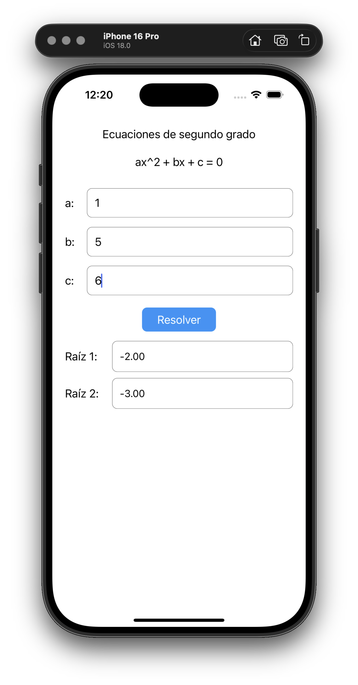
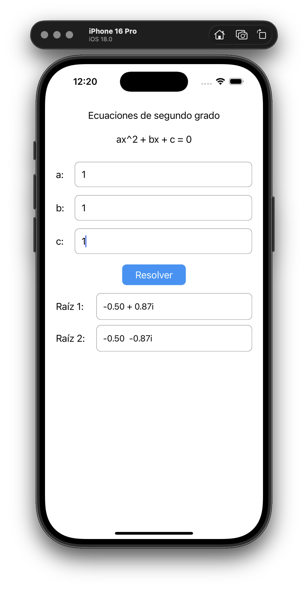
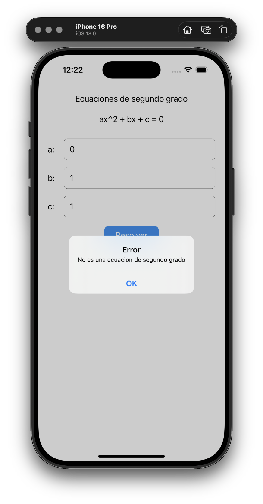

# Resolvedor de Ecuaciones Cuadráticas

Una aplicación móvil en React Native que resuelve ecuaciones de segundo grado siguiendo el patrón de arquitectura **MVC (Modelo-Vista-Controlador)**.

## 📱 Capturas de Pantalla

### Ecuación con Raíces Reales

### Ecuación con Raíces Complejas  

### Validación de Errores
